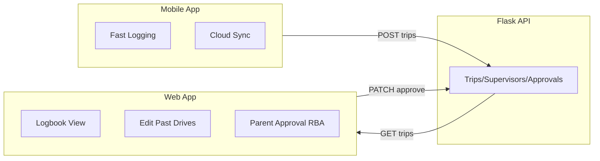

# L-Plate Tracker — AI-Assisted Development Documentation

This document records prompts given to AI and plans generated, demonstrating use of AI as a development tool for the L-Plate Tracker project. It is included to satisfy the school requirement for documenting AI usage.

---

## 1. Purpose

This file documents:

- **Original prompts** — The initial specification and requirements for the L-Plate Tracker app
- **Follow-up prompts** — Refinements based on wireframes and design feedback
- **AI-generated improvement plan** — The structured plan produced by the AI in response
- **Consolidated spec** — The final specification after applying the plan

---

## 2. Original Prompts

The following prompt was provided to define the L-Plate Tracker project:

---

### L-Plate Tracker — Capacitor Native App (Vibe Code Prompt)

#### Project Overview

Build a **Capacitor** native mobile app (iOS/Android) for tracking NSW learner driver logbook hours. The **phone is the primary data logger** — it records GPS and accelerometer data using its own native sensors throughout the trip. The app connects via **Bluetooth Low Energy (BLE)** to an ESP32-C3 in the car which is plugged into the car's **OBD2 port**. The phone sends a "start" command to the ESP32 over BLE at trip start, and at the end of the trip the ESP32 transfers all the OBD2 data it collected (speed, RPM, engine data, etc.) back to the phone over BLE.

**Data flow summary:**
- **Phone logs during trip:** GPS coordinates, accelerometer, timestamps (using native Capacitor plugins)
- **ESP32 logs during trip:** OBD2 data (vehicle speed, RPM, engine load, coolant temp, etc.)
- **At trip end:** ESP32 sends its OBD2 data dump to the phone over BLE. The phone merges both datasets into one complete trip record.

**Key constraint:** The BLE connection, OBD2 data transfer, and API backend do not exist yet. **Mock all three** so development can proceed on the app UI and logic independently. The mocks must be easy to swap out for real implementations later.

#### Tech Stack

| Layer | Choice |
|-------|--------|
| Framework | Ionic + React (or React standalone + Capacitor) |
| Native runtime | Capacitor 6+ |
| Language | JavaScript (ES6+) |
| State management | React Context or Zustand (keep it simple) |
| Routing | React Router |
| Styling | Tailwind CSS or Ionic components |
| BLE | @capacitor-community/bluetooth-le (mocked for now) |
| GPS | @capacitor/geolocation (real during dev) |
| Motion | @capacitor/motion (accelerometer — real during dev) |
| HTTP | @capacitor/http or fetch (mocked for now) |
| Local storage | @capacitor/preferences or SQLite |
| Build | Vite + Capacitor CLI |

#### Architecture

Mobile app (Capacitor) with:
- Native sensor services (GPS, accelerometer — real)
- Service layer: BLE, API, Sensors — all behind interfaces
- Mock BLE + Mock API for development; swap for real later

ESP32-C3 connects via BLE, reads OBD2 from car, sends data to phone at trip end.

#### Screens & Features

1. Dashboard — trip status, START/STOP, summary stats, recent trips
2. Start Trip Flow — supervisor, weather, odometer, tap Start
3. Active Trip View — live map, elapsed time, speed, STOP button
4. Stop Trip Flow — end odometer, OBD2 transfer, trip summary
5. Trip History / Logbook
6. Trip Detail — map, speed chart, RPM chart, accel events
7. Supervisor Management
8. Device Management (BLE)
9. Settings
10. Sync Status

#### Data Models

Supervisor, UserProfile, Trip, GpsPoint, AccelPoint, Obd2Sample, BleDevice, DeviceInfo, LogbookSummary.

---

## 3. Follow-up Prompts

### Add Light Mode

Add light mode support to the app. Include a theme toggle in Settings so users can switch between dark and light themes. Persist the preference in localStorage. Use CSS variables and Tailwind `dark:` variants so all screens and components render correctly in both themes.

---

The following refinements were also requested:

- Make it look more like the wireframe image (adjusted for mobile, not desktop)
- Use pie/ring charts for drive progress display
- Add **RBA for parents to approve their kids' drives**
- **Only use ODO from the ESP** — not all the other OBD2 data (speed, RPM, etc.)
- The **ESP does not sync with WiFi** — it only transfers over Bluetooth
- When the app is open, **automatically sync/connect Bluetooth**
- **Auto-sync to cloud** if on mobile data; if not connected, let the user know they are not synced
- **Optimise the start flow**: home screen → select car → select SD → Start; make them enter **weather at the end** but give option to skip; optionally use a weather API

Wireframe reference: added image showing main logging (green Start, red Stop), pre-filled odometer, supervisor picker (SD Mum, SD Dad, SD Other), active trip with "DO NOT LOOK AT PHONE" banner, progress rings (day, total, night), trip table with approval state (approved/not approved).

---

## 4. AI-Generated Improvement Plan

### Summary of Changes

1. **Fast-logging mobile UX** — Minimal taps, big buttons, pre-filled values
2. **Mobile vs web split** — Phone = fast logging; website = sophisticated review + parent approval
3. **Parent RBA** — Parents approve drives in the web interface
4. **ESP32 simplification** — Odometer only (no full OBD2 data transfer)
5. **Sync and BLE behaviour** — Auto-connect, cloud sync rules, WiFi removal from ESP32
6. **Optimised start flow** — Car → SD → Start; weather at end with skip

### Wireframe Reference Section

- Main logging: big green Start / red Stop
- Pre-filled odometer, "enter last 3 digits of ODO" quick confirm
- Supervisor picker: SD Mum, SD Dad, SD Other
- Active trip: minimal, "DO NOT LOOK AT PHONE" banner, duration, distance, current ODO
- Add Wi-Fi network screen for ESP32 config (optional)
- Web: progress rings (day, total, night), trip table, "accept kid" approval view

### Architecture: Mobile vs Web Split

| Platform | Purpose |
|----------|---------|
| **Mobile app (Capacitor)** | Fast logging only — start/stop trips, minimal inputs, glanceable active trip |
| **Web app** | Sophisticated UI — logbook view, edit past drives, parent approval, add parent, progress rings |



### Fast-Logging UX

- Minimal taps: select car → select SD → confirm ODO → Start
- Pre-filled odometer with "Enter last 3 digits" quick confirm
- Weather at end with "Skip" option
- Big green Start, big red Stop buttons
- Active trip: "DO NOT LOOK AT PHONE WHILE DRIVING" banner, glanceable only

### ESP32 Simplification

- ESP32 provides **odometer only** — `{ startOdo, endOdo }` at trip end
- No OBD2 speed, RPM, engine load transfer
- No WiFi sync from ESP32 — Bluetooth only
- Replace `requestObd2Data()` with `requestOdometerData()`

### BLE and Sync

- **Auto-connect BLE** when app opens (if previously paired ESP32 in range)
- **Cloud sync**: auto on mobile data/WiFi; show "Not synced" when offline

### Parent RBA

- Web app: "Accept kid" view with approve/reject per trip
- Trip model: `approvalState`, `approvedBy`, `approvedAt`
- API: `PATCH /api/trips/<id>/approve`

### Progress Display

- Three circular progress rings: progress day, progress total, progress night

### Implementation Priority

1. Project scaffold
2. Models (Car, approval fields, simplified ODO)
3. Mock BLE (odo only), mock API (approval)
4. Dashboard — car + SD, big Start, progress rings
5. Start flow — car → SD → odo confirm (last 3 digits)
6. Active trip — minimal, "DO NOT LOOK" banner
7. Stop flow — end ODO, weather with skip
8. Trip history and detail
9. Supervisor management
10. Device management (simplified)
11. Settings and sync (with "Not synced" indicator)

---

## 5. Consolidated Spec (Updated)

This is the final L-Plate Tracker specification after applying the improvement plan.

---

### Project Overview

Build a **Capacitor** native mobile app (iOS/Android) for tracking NSW learner driver logbook hours. The **phone is the primary data logger** — it records GPS and accelerometer data using its own native sensors. The app connects via **BLE** to an ESP32-C3 in the car; at trip end the ESP32 transfers **odometer only** (start/end) to the phone over BLE.

**Platform split:**
- **Mobile app** — Fast logging: minimal taps, big buttons, glanceable active trip
- **Web app** — Sophisticated UI: logbook view, edit past drives, parent approval (RBA)

**Data flow:** Phone logs GPS + accelerometer. ESP32 provides odometer from car OBD2. At trip end: ESP32 sends `{ startOdo, endOdo }` over BLE. Mobile syncs trips to Flask API. Web app consumes API for review and parent approval.

---

### Wireframe Reference

See `docs/wireframes/lplate-wireframe.png` for the design reference. Design aligns with wireframe (adjusted for mobile):

- **Main logging:** Big green Start, red Stop
- **Odometer:** Pre-filled from last known; "Enter last 3 digits" quick confirm
- **Supervisor:** SD Mum, SD Dad, SD Other (quick picker)
- **Active trip:** Minimal UI, "DO NOT LOOK AT PHONE WHILE DRIVING" banner; duration, distance, current ODO, big Stop
- **Web (logbook):** Three progress rings (day, total, night); trip table with columns: length (time), length (distance), SD, hard braking count, state (approved/not approved)

---

### Tech Stack

| Layer | Choice |
|-------|--------|
| Framework | React + Capacitor |
| Runtime | Capacitor 6+ |
| Language | JavaScript (ES6+) |
| State | React Context or Zustand |
| Routing | React Router |
| Styling | Tailwind CSS |
| BLE | @capacitor-community/bluetooth-le (mocked) |
| GPS | @capacitor/geolocation (real) |
| Motion | @capacitor/motion (real) |
| Build | Vite + Capacitor CLI |

---

### Fast-Logging Design Principles

- **Minimal taps to start** — Home: select car (if multiple) → select SD → confirm ODO (last 3 digits) → Start
- **Pre-filled odometer** — From ESP32 or last trip; quick "Enter last 3 digits" confirm
- **Weather at end** — Stop flow only; "Skip" option; optionally use weather API to pre-fill
- **Big buttons** — Start (green), Stop (red), high-contrast
- **Active trip** — Glanceable: duration, distance, current ODO, weather input, big Stop; "DO NOT LOOK AT PHONE" banner
- **Supervisor picker** — Mum, Dad, Other+add

---

### BLE & Sync Behaviour

- **Auto-connect BLE** — When app opens, auto-connect to previously paired ESP32 if in range
- **ESP32 — Bluetooth only** — No WiFi sync from ESP32; all data transfer via BLE
- **Cloud sync** — Auto-sync on mobile data/WiFi; show "Not synced" when offline; manual sync when back online

---

### Screens & Features (Mobile)

1. **Dashboard** — Car + SD selection, big Start, progress rings (total, day, night), recent trips
2. **Start Trip** — Select car → select SD → confirm odometer (last 3 digits) → Start
3. **Active Trip** — Minimal: duration, distance, current ODO, "DO NOT LOOK AT PHONE" banner, big Stop
4. **Stop Trip** — Confirm end odometer (from ESP32 or manual); weather picker with Skip; trip summary
5. **Trip History** — List, filters, approval badge
6. **Trip Detail** — Map, GPS speed chart, accel events (no OBD2 charts)
7. **Supervisor Management**
8. **Device Management** — Scan, connect, status (no WiFi config; BLE only)
9. **Settings**
10. **Sync Status** — Pending sync, "Not synced" indicator, manual Sync Now

---

### Web App (Reference)

- Logbook view with three progress rings
- Trip table: length (time), length (distance), SD, hard braking count, state (approved/not approved)
- **Parent Approval (RBA)** — Accept kid view; approve/reject per trip

---

### BLE Service (Odometer Only)

```javascript
// ESP32 provides odometer only at trip end
requestOdometerData() → Promise<{ startOdo: number; endOdo: number }>
// No requestObd2Data(); no Obd2TripData
```

- `sendStartCommand()`, `sendStopCommand()` unchanged
- `requestOdometerData()` replaces `requestObd2Data()` — short transfer, no progress bar needed (or simple spinner)
- `DeviceInfo`: remove `wifiConfigured`, `wifiSsid` — ESP32 BLE only

---

### Data Models (Updated)

**Trip:** Add `approvalState`, `approvedBy`, `approvedAt`; remove full OBD2 data; keep `startOdometer`, `endOdometer` (from ESP32 or manual).

**Car** (if multi-car):

```javascript
interface Car {
  id: string;
  name: string;
  lastOdometer?: number;
  esp32DeviceId?: string;
}
```

---

### API Additions

- `PATCH /api/trips/<id>/approve` → `{ success }`
- `GET /api/cars`, `POST /api/cars` (if multi-car)
- Trip response includes `approvalState`, `approvedBy`, `approvedAt`

---

### Remove / Defer

- Full OBD2 data transfer (speed, RPM, engine load)
- Obd2TransferProgress component (or replace with simple "Getting odometer…" spinner)
- Speed/RPM charts from OBD2 (use GPS speed chart only)
- ESP32 WiFi credential management

---

### File Structure (2_js)

```
2_js/
├── capacitor.config.json
├── package.json
├── vite.config.js
├── src/
│   ├── App.jsx
│   ├── main.jsx
│   ├── config.js
│   ├── models/           (trip, supervisor, car, gps, accel, device)
│   ├── services/
│   │   ├── ble/          (odo only)
│   │   ├── api/
│   │   ├── sensors/
│   │   ├── tripManager/
│   │   └── location/
│   ├── hooks/
│   ├── context/
│   ├── pages/
│   ├── components/       (ProgressRing for day/total/night)
│   └── utils/
├── android/
├── ios/
└── prompts.md            ← this file
```

---

### NSW Logbook Requirements

- 120 total hours; 20 night hours
- Each trip: date, times, odometer, supervisor, weather
- 90 km/h max speed warning
- Pre-drive reminders: L-plates, zero BAC, supervisor present
