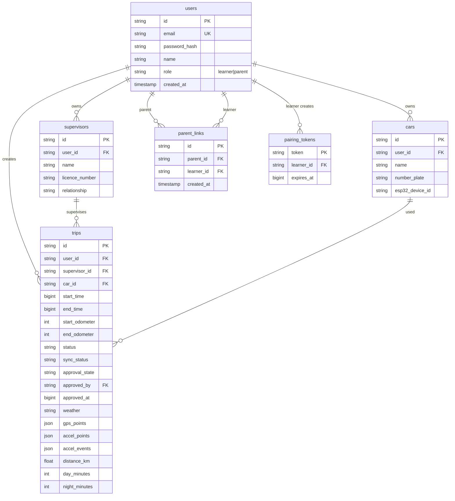

# L-Plate Tracker — API & Database Design

Design for the Flask backend and database to support auth, parent-kid pairing (QR), trips, and approvals.

---

## 1. Database Schema

### 1.1 Entity-Relationship Overview



---

### 1.2 Tables

#### `users`
| Column | Type | Notes |
|--------|------|-------|
| id | UUID | PK |
| email | VARCHAR(255) | UNIQUE, NOT NULL |
| password_hash | VARCHAR(255) | bcrypt/argon2 |
| name | VARCHAR(100) | Display name |
| role | ENUM('learner','parent') | Required for pairing/approval logic |
| created_at | TIMESTAMP | |

#### `trips`
| Column | Type | Notes |
|--------|------|-------|
| id | UUID | PK |
| user_id | UUID | FK → users (learner who did the trip) |
| supervisor_id | UUID | FK → supervisors |
| supervisor_name | VARCHAR(100) | Denormalised for display |
| car_id | UUID | FK → cars, nullable |
| start_time | BIGINT | Unix ms |
| end_time | BIGINT | Unix ms, nullable |
| start_odometer | INT | km |
| end_odometer | INT | km, nullable |
| status | ENUM | pending, active, stopped, complete |
| sync_status | ENUM | unsynced, syncing, synced, error |
| approval_state | ENUM | pending, approved, rejected |
| approved_by | UUID | FK → users, nullable |
| approved_at | BIGINT | Unix ms, nullable |
| weather | VARCHAR(20) | sunny, overcast, rain, night |
| gps_points | JSONB / JSON | Array of GpsPoint |
| accel_points | JSONB / JSON | Array of AccelPoint |
| accel_events | JSONB / JSON | Array of AccelEvent |
| distance_km | FLOAT | nullable |
| day_minutes | INT | nullable |
| night_minutes | INT | nullable |
| max_speed_kmh | FLOAT | nullable |
| avg_speed_kmh | FLOAT | nullable |
| odo_source | VARCHAR(10) | esp32, manual |
| created_at | TIMESTAMP | |
| updated_at | TIMESTAMP | |

#### `supervisors`
| Column | Type | Notes |
|--------|------|-------|
| id | UUID | PK |
| user_id | UUID | FK → users (learner who owns this list) |
| name | VARCHAR(100) | |
| licence_number | VARCHAR(50) | nullable |
| relationship | VARCHAR(20) | Parent, Instructor, Friend, Other |
| created_at | TIMESTAMP | |

#### `cars`
| Column | Type | Notes |
|--------|------|-------|
| id | UUID | PK |
| user_id | UUID | FK → users |
| name | VARCHAR(100) | Display name |
| number_plate | VARCHAR(20) | nullable |
| last_odometer | INT | nullable |
| esp32_device_id | VARCHAR(100) | BLE device ID, nullable |
| created_at | TIMESTAMP | |
| updated_at | TIMESTAMP | |

#### `parent_links`
| Column | Type | Notes |
|--------|------|-------|
| id | UUID | PK |
| parent_id | UUID | FK → users |
| learner_id | UUID | FK → users |
| created_at | TIMESTAMP | |
| UNIQUE(parent_id, learner_id) | | Prevent duplicate links |

#### `pairing_tokens`
| Column | Type | Notes |
|--------|------|-------|
| token | VARCHAR(32) | PK (e.g. PAIR-ABC123XYZ) |
| learner_id | UUID | FK → users |
| expires_at | BIGINT | Unix ms, typically 15 min TTL |

---

## 2. API Endpoints

### 2.1 Auth

| Method | Endpoint | Auth | Body | Response |
|--------|----------|------|------|----------|
| POST | `/api/auth/register` | No | `{ email, password, name, role }` | `{ token, userId, name, role }` |
| POST | `/api/auth/login` | No | `{ email, password }` | `{ token, userId, name, role }` |
| GET | `/api/auth/me` | Bearer | - | `{ userId, name, role, email }` |

**Notes:**
- Token: JWT (e.g. 7-day expiry)
- `role`: `"learner"` or `"parent"` (set at register)

---

### 2.2 Pairing (Option B: Kid shows QR, parent scans)

| Method | Endpoint | Auth | Body | Response |
|--------|----------|------|------|----------|
| POST | `/api/pair/create` | Bearer (learner) | - | `{ token: "PAIR-XYZ123", expiresAt: 1234567890 }` |
| POST | `/api/pair/complete` | Bearer (parent) | `{ token: "PAIR-XYZ123" }` | `{ success: true, learnerName: "Alex" }` |
| GET | `/api/pair/linked` | Bearer (parent) | - | `[{ learnerId, learnerName }]` |
| DELETE | `/api/pair/linked/:learnerId` | Bearer (parent) | - | `{ success: true }` |

**Logic:**
- `create`: Learner creates pairing token; store in `pairing_tokens` with 15-min TTL
- `complete`: Parent submits token; validate, create `parent_links` row, delete token
- `linked`: Return learners linked to this parent

---

### 2.3 Trips

| Method | Endpoint | Auth | Body | Response |
|--------|----------|------|------|----------|
| POST | `/api/trips` | Bearer | Trip object | `{ id, cloudId }` |
| GET | `/api/trips` | Bearer | Query: `supervisorId, dateFrom, dateTo, nightOnly, dayOnly` | `Trip[]` |
| GET | `/api/trips/:id` | Bearer | - | `Trip` |
| PATCH | `/api/trips/:id` | Bearer | Partial trip | `Trip` |
| DELETE | `/api/trips/:id` | Bearer | - | `{ success: true }` |
| PATCH | `/api/trips/:id/approve` | Bearer (parent) | `{ approved: true\|false }` | `{ success: true }` |

**Access rules:**
- **Learner:** `GET` / `POST` / `PATCH` / `DELETE` only for their own trips (`user_id = me`)
- **Parent:** `GET` returns trips for linked learners; `PATCH approve` only for trips of linked learners

---

### 2.4 Supervisors

| Method | Endpoint | Auth | Body | Response |
|--------|----------|------|------|----------|
| GET | `/api/supervisors` | Bearer | - | `Supervisor[]` |
| POST | `/api/supervisors` | Bearer | `{ name, licenceNumber, relationship }` | `Supervisor` |
| PATCH | `/api/supervisors/:id` | Bearer | `{ name, licenceNumber, relationship }` | `Supervisor` |
| DELETE | `/api/supervisors/:id` | Bearer | - | `{ success: true }` |

**Access:** Only learner’s own supervisors (`user_id = me`)

---

### 2.5 Cars

| Method | Endpoint | Auth | Body | Response |
|--------|----------|------|------|----------|
| GET | `/api/cars` | Bearer | - | `Car[]` |
| POST | `/api/cars` | Bearer | `{ name, numberPlate }` | `Car` |
| PATCH | `/api/cars/:id` | Bearer | `{ name, numberPlate, lastOdometer, esp32DeviceId }` | `Car` |
| DELETE | `/api/cars/:id` | Bearer | - | `{ success: true }` |

**Access:** Only user’s own cars

---

### 2.6 Logbook Summary

| Method | Endpoint | Auth | Body | Response |
|--------|----------|------|------|----------|
| GET | `/api/logbook/summary` | Bearer | - | `LogbookSummary` |

**Response:** `{ totalHours, dayHours, nightHours, tripCount, targetHours, nightTargetHours, lastTripDate }`

**Access:**
- **Learner:** Own trips only
- **Parent:** Not typically used; or aggregate across linked learners (optional)

---

### 2.7 Devices (optional)

| Method | Endpoint | Auth | Body | Response |
|--------|----------|------|------|----------|
| POST | `/api/devices/register` | Bearer | `{ mac, deviceId }` | `{ success: true }` |

For BLE device association; can be deferred.

---

## 3. Request / Response Examples

### Register (learner)
```http
POST /api/auth/register
Content-Type: application/json

{
  "email": "alex@example.com",
  "password": "secret123",
  "name": "Alex",
  "role": "learner"
}

Response 200:
{
  "token": "eyJ...",
  "userId": "550e8400-e29b-41d4-a716-446655440000",
  "name": "Alex",
  "role": "learner"
}
```

### Create pairing token (learner)
```http
POST /api/pair/create
Authorization: Bearer eyJ...

Response 200:
{
  "token": "PAIR-7K9M2X4P",
  "expiresAt": 1709012345678
}
```

### Complete pairing (parent)
```http
POST /api/pair/complete
Authorization: Bearer eyJ...
Content-Type: application/json

{ "token": "PAIR-7K9M2X4P" }

Response 200:
{
  "success": true,
  "learnerName": "Alex"
}
```

### Get trips (parent)
```http
GET /api/trips
Authorization: Bearer eyJ...

Response 200:
[
  {
    "id": "trip-uuid",
    "userId": "learner-uuid",
    "supervisorId": "sup-001",
    "supervisorName": "Mum",
    "startTime": 1708900000000,
    "endTime": 1708902700000,
    "approvalState": "pending",
    "dayMinutes": 45,
    "nightMinutes": 0,
    ...
  }
]
```

### Approve trip (parent)
```http
PATCH /api/trips/trip-uuid/approve
Authorization: Bearer eyJ...
Content-Type: application/json

{ "approved": true }

Response 200:
{ "success": true }
```

---

## 4. SQLite Schema (Flask Development)

For a simple HSC setup, SQLite is sufficient. Enable foreign keys per connection: `PRAGMA foreign_keys = ON;`

```sql
-- =============================================================================
-- L-Plate Tracker — SQLite Schema (updated)
-- =============================================================================
-- Enable foreign key enforcement (must run per connection)
PRAGMA foreign_keys = ON;

-- =============================================================================
-- 1. CREATE TABLE statements (in dependency order)
-- =============================================================================

CREATE TABLE users (
    id              TEXT PRIMARY KEY,
    email           TEXT NOT NULL UNIQUE,
    password_hash   TEXT NOT NULL,
    name            TEXT NOT NULL,
    role            TEXT NOT NULL CHECK (role IN ('learner', 'parent')),
    licence_number  TEXT,
    created_at      INTEGER NOT NULL
);

CREATE TABLE supervisors (
    id              TEXT PRIMARY KEY,
    user_id         TEXT NOT NULL REFERENCES users(id) ON DELETE CASCADE,
    name            TEXT NOT NULL,
    licence_number  TEXT,
    relationship    TEXT NOT NULL CHECK (relationship IN ('Parent', 'Instructor', 'Friend', 'Other')),
    created_at      INTEGER NOT NULL,
    updated_at      INTEGER NOT NULL
);

CREATE TABLE cars (
    id              TEXT PRIMARY KEY,
    user_id         TEXT NOT NULL REFERENCES users(id) ON DELETE CASCADE,
    name            TEXT NOT NULL,
    number_plate    TEXT,
    last_odometer   REAL,
    esp32_device_id TEXT,
    created_at      INTEGER NOT NULL,
    updated_at      INTEGER NOT NULL
);

CREATE TABLE parent_links (
    id              TEXT PRIMARY KEY,
    parent_id       TEXT NOT NULL REFERENCES users(id) ON DELETE CASCADE,
    learner_id      TEXT NOT NULL REFERENCES users(id) ON DELETE CASCADE,
    created_at      INTEGER NOT NULL,
    UNIQUE (parent_id, learner_id),
    CHECK (parent_id != learner_id)
);

CREATE TABLE pairing_tokens (
    token           TEXT PRIMARY KEY,
    learner_id      TEXT NOT NULL REFERENCES users(id) ON DELETE CASCADE,
    expires_at      INTEGER NOT NULL
);

CREATE TABLE trips (
    id              TEXT PRIMARY KEY,
    user_id         TEXT NOT NULL REFERENCES users(id) ON DELETE CASCADE,
    supervisor_id   TEXT REFERENCES supervisors(id) ON DELETE SET NULL,
    supervisor_name TEXT,
    car_id          TEXT REFERENCES cars(id) ON DELETE SET NULL,
    car_name        TEXT,
    learner_name    TEXT,
    cloud_id        TEXT,
    start_time      INTEGER NOT NULL,
    end_time        INTEGER,
    start_odometer  REAL,
    end_odometer    REAL,
    start_lat       REAL,
    start_lng       REAL,
    status          TEXT NOT NULL DEFAULT 'pending'
                        CHECK (status IN ('pending', 'active', 'stopped', 'complete')),
    sync_status     TEXT NOT NULL DEFAULT 'unsynced'
                        CHECK (sync_status IN ('unsynced', 'syncing', 'synced', 'error')),
    approval_state  TEXT NOT NULL DEFAULT 'pending'
                        CHECK (approval_state IN ('pending', 'approved', 'rejected')),
    approved_by     TEXT REFERENCES users(id) ON DELETE SET NULL,
    approved_at     INTEGER,
    weather         TEXT CHECK (weather IN ('sunny', 'overcast', 'rain', 'night')),
    gps_points      TEXT,
    accel_points    TEXT,
    accel_events    TEXT,
    distance_km     REAL,
    odo_distance_km REAL,
    day_minutes     REAL,
    night_minutes   REAL,
    max_speed_kmh   REAL,
    avg_speed_kmh   REAL,
    odo_source      TEXT CHECK (odo_source IN ('esp32', 'manual')),
    version         INTEGER NOT NULL DEFAULT 1,
    created_at      INTEGER NOT NULL,
    updated_at      INTEGER NOT NULL
);

-- =============================================================================
-- 2. CREATE INDEX statements
-- =============================================================================

CREATE INDEX idx_users_role              ON users(role);
CREATE INDEX idx_supervisors_user_id     ON supervisors(user_id);
CREATE INDEX idx_cars_user_id            ON cars(user_id);
CREATE INDEX idx_cars_esp32_device_id    ON cars(esp32_device_id) WHERE esp32_device_id IS NOT NULL;
CREATE INDEX idx_parent_links_parent_id  ON parent_links(parent_id);
CREATE INDEX idx_parent_links_learner_id ON parent_links(learner_id);
CREATE INDEX idx_pairing_tokens_learner  ON pairing_tokens(learner_id);
CREATE INDEX idx_pairing_tokens_expires  ON pairing_tokens(expires_at);
CREATE INDEX idx_trips_user_id           ON trips(user_id);
CREATE INDEX idx_trips_approval_state    ON trips(approval_state);
CREATE INDEX idx_trips_created_at        ON trips(created_at);
CREATE INDEX idx_trips_supervisor_id     ON trips(supervisor_id);
CREATE INDEX idx_trips_user_status       ON trips(user_id, status);
CREATE INDEX idx_trips_user_approval     ON trips(user_id, approval_state);
CREATE INDEX idx_trips_user_created      ON trips(user_id, created_at);
```

---

## 5. Summary

| Area | Tables | Key endpoints |
|------|--------|---------------|
| Auth | users | register, login, me |
| Pairing | parent_links, pairing_tokens | pair/create, pair/complete |
| Trips | trips | trips CRUD, trips/:id/approve |
| Supervisors | supervisors | supervisors CRUD |
| Cars | cars | cars CRUD |
| Logbook | (derived) | logbook/summary |
