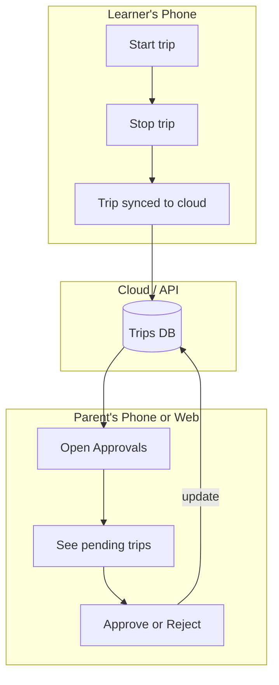

# Parent Approval — Storyboard

A visual/text storyboard of how the parent approval (RBA) flow works from the user's perspective.

---

## Flow Overview



---

## Scene 1 — Learner Completes a Trip

**Screen:** Mobile app — Stop Trip page

**What happens:**
1. Learner finishes a drive and taps Stop.
2. End odometer and weather are entered (or skipped).
3. Trip is saved locally and synced to the cloud.
4. Trip has `approvalState: 'pending'` by default.

**Visual:**
```
┌─────────────────────────────┐
│  Trip Complete              │
│  45 min • 12 km             │
│  Supervisor: Mum            │
│                             │
│  [ Sync Complete ✓ ]        │
│                             │
│  Pending parent approval    │
└─────────────────────────────┘
```

---

## Scene 2 — Parent Opens Approvals (Web or Mobile)

**Screen:** Parent Approvals page

**What happens:**
1. Parent logs in (or is already logged in).
2. Clicks "Approve Trips" from Settings or the tab bar.
3. Sees a list of trips awaiting approval.

**Visual:**
```
┌─────────────────────────────────────────┐
│  Approve Trips                    [↻]   │
├─────────────────────────────────────────┤
│  2 trips need your approval             │
├─────────────────────────────────────────┤
│                                         │
│  Sat 15 Feb • 45 min • Dad              │
│  Overcast • 12.3 km                     │
│  [✓ Approve]  [✗ Reject]                │
│                                         │
│  Thu 13 Feb • 1 hr • Mum                │
│  Night • 22 km                          │
│  [✓ Approve]  [✗ Reject]                │
│                                         │
└─────────────────────────────────────────┘
```

---

## Scene 3 — Parent Approves a Trip

**Screen:** Same Parent Approvals page

**What happens:**
1. Parent taps "✓ Approve" on a trip.
2. API updates the trip: `approvalState: 'approved'`, `approvedBy`, `approvedAt`.
3. Trip disappears from the pending list (or shows as approved).
4. Parent can optionally see a brief confirmation.

**Visual:**
```
┌─────────────────────────────────────────┐
│  Approved ✓                             │
│  Sat 15 Feb — 45 min                    │
└─────────────────────────────────────────┘

(List refreshes; that trip no longer in "pending" section)
```

---

## Scene 4 — Parent Rejects a Trip

**Screen:** Same Parent Approvals page

**What happens:**
1. Parent taps "✗ Reject" on a trip.
2. API updates the trip: `approvalState: 'rejected'`.
3. Trip is marked as rejected in the logbook.
4. Learner can see "Rejected" on the trip in their history.

**Visual:**
```
┌─────────────────────────────────────────┐
│  Rejected ✗                              │
│  Thu 13 Feb — 1 hr (night)              │
└─────────────────────────────────────────┘
```

---

## Scene 5 — Learner Views Logbook

**Screen:** Logbook / Trip History

**What happens:**
1. Learner opens Logbook.
2. Each trip shows an approval badge: Pending / Approved / Rejected.

**Visual:**
```
┌─────────────────────────────────────────┐
│  Sat 15 Feb    9:00 – 9:45     Mum      │
│  45 min • 12 km                         │
│  ✓ Approved                             │
└─────────────────────────────────────────┘

┌─────────────────────────────────────────┐
│  Thu 13 Feb    7:00 – 8:00     Mum      │
│  1 hr • 22 km  🌙 Night                 │
│  Pending approval                       │
└─────────────────────────────────────────┘

┌─────────────────────────────────────────┐
│  Mon 10 Feb    8:00 – 8:20     Dad      │
│  20 min • 5 km  🌙 Night                │
│  Rejected                               │
└─────────────────────────────────────────┘
```

---

## Scene 6 — NSW Logbook Format View

**Screen:** Trip History with "Log book format" toggled on

**What happens:**
1. Learner (or parent) switches to NSW logbook table view.
2. Table includes an Approval column: ✓ Approved, Pending, Rejected.

**Visual:**
```
┌──────┬──────────┬───────┬────────┬──────────┬──────┬───────┬──────────┬──────────┐
│  ✓   │ Date     │ Start │ Finish │ Duration │ Day  │ Night │ Supervisor│ Approval │
├──────┼──────────┼───────┼────────┼──────────┼──────┼───────┼──────────┼──────────┤
│  □   │ 15/02/25 │ 9:00  │ 9:45   │ 0:45     │ 0:45 │ —     │ Mum      │ Approved │
│  □   │ 13/02/25 │ 19:00 │ 20:00  │ 1:00     │ —    │ 1:00  │ Mum      │ Pending  │
│  □   │ 10/02/25 │ 20:00 │ 20:20  │ 0:20     │ —    │ 0:20  │ Dad      │ Rejected │
└──────┴──────────┴───────┴────────┴──────────┴──────┴───────┴──────────┴──────────┘
```

---

## User Roles (Simplified for HSC)

| Role   | Typical use                  | Can approve? |
|--------|------------------------------|--------------|
| Learner| Log trips on phone           | No           |
| Parent | Review and approve trips     | Yes          |

For the demo: log in as `parent@test.com` to see Approvals; log in as `learner@test.com` to see learner view. Or show Approvals to everyone and explain in the report.
