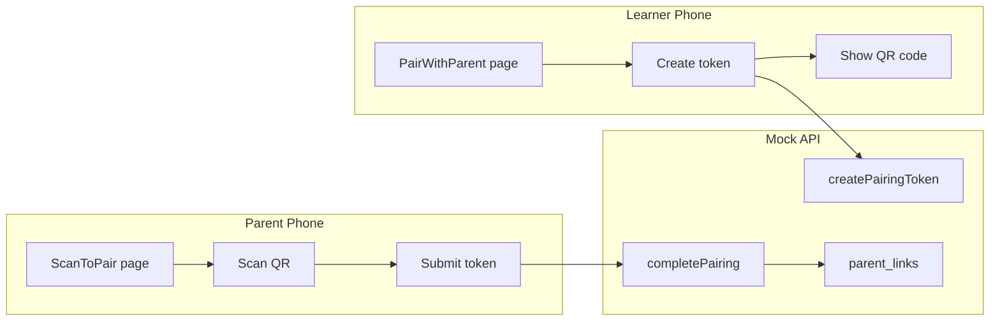

# Project State Review & QR Code Pairing Implementation Plan

---

## 1. Current Project State

### 1.1 What's Done

| Feature | Status | Notes |
|---------|--------|-------|
| **Phase 1: Parent Approval** | Done | ParentApprovals page, approve/reject, role guard |
| **Phase 2: Auth Basics** | Done | Login, Register, route protection, token persist, logout |
| **Phase 3: Role-Based UI** | Done | Approvals tab only for parent, TabBar conditional |
| Login page | Done | Login + Register, role selection (parent/learner) |
| AuthContext | Done | user, login, register, logout, restoring |
| Mock API: login/register | Done | Returns role; parent@demo.com → parent |
| Mock API: getCurrentUser | Done | Restores session on load |
| Mock API: logout | Done | Clears token and currentUser |
| Mock API: approveTrip | Done | Updates approvalState |
| Mock API: getLinkedLearners | Done | Returns hardcoded list (Alex, Jordan) |
| useLinkedLearners hook | Done | Fetches linked learners |
| ParentApprovals | Done | Table with approve/reject, learner filter |
| Trips with learnerId | Done | Migration assigns learnerId to existing trips |

### 1.2 What's Missing or Incomplete

| Gap | Impact |
|-----|--------|
| **getLinkedLearners is hardcoded** | Always returns Alex, Jordan; not based on actual pairing |
| **getTrips does not filter by linked learners** | Parent sees all trips, not just linked kids' trips |
| **No createPairingToken** | Cannot generate QR pairing token |
| **No completePairing** | Cannot link parent to learner via QR |
| **No parent_links storage** | No persistence of who is linked to whom |
| **No pairing_tokens storage** | No way to validate QR tokens |
| **No PairWithParent page** | Learner cannot show QR |
| **No ScanToPair page** | Parent cannot scan QR |
| **No qrcode package** | Cannot generate QR images |
| **No barcode-scanner** | Cannot scan QR with camera |
| **Trip creation may not set learnerId** | Need to ensure syncTrip/saveLocalTrip sets learnerId for learner |
| **Login returns same userId for parent@demo.com** | Both parent and learner logins use mock-user-001; need distinct IDs for pairing |

### 1.3 Data Flow Today

```
Learner logs in → userId (mock-user-001 for learner@demo.com)
Parent logs in   → userId (mock-user-001 for parent@demo.com)  ← PROBLEM: same ID
getLinkedLearners → hardcoded [Alex, Jordan]
getTrips         → all trips (no filtering by parent's linked learners)
```

---

## 2. QR Code Pairing Plan (Option B: Kid Shows QR, Parent Scans)

### 2.1 Overview



### 2.2 Implementation Order

---

#### Step 1: Mock API — Fix user IDs and add pairing storage

**Files:** `api.mock.js`

**Tasks:**
- Give parent@demo.com and learner@demo.com distinct userIds (e.g. `parent-demo-001`, `learner-demo-001`) so pairing logic works.
- Add Preferences keys: `mock_parent_links`, `mock_pairing_tokens`.
- `parent_links`: `[{ parentId, learnerId }]`
- `pairing_tokens`: `{ "PAIR-XXX": { learnerId, expiresAt } }`

---

#### Step 2: Mock API — createPairingToken

**Files:** `api.mock.js`

**Signature:** `createPairingToken()` → `Promise<{ token, expiresAt }>`

**Logic:**
- Require current user (getCurrentUser); must be learner.
- Generate token: `PAIR-` + 8 random alphanumeric chars.
- Store in pairing_tokens: `{ token, learnerId: user.userId, expiresAt: Date.now() + 15*60*1000 }`.
- Return `{ token, expiresAt }`.

---

#### Step 3: Mock API — completePairing

**Files:** `api.mock.js`

**Signature:** `completePairing(token)` → `Promise<{ success, learnerName }>`

**Logic:**
- Require current user; must be parent.
- Look up token in pairing_tokens; if missing or expired, throw.
- Add `{ parentId: user.userId, learnerId }` to parent_links (avoid duplicates).
- Delete token from pairing_tokens.
- Get learner name from userProfiles or a simple map; return `{ success: true, learnerName }`.

---

#### Step 4: Mock API — getLinkedLearners (real implementation)

**Files:** `api.mock.js`

**Logic:**
- Load parent_links from Preferences.
- Filter to rows where `parentId === currentUser.userId`.
- For each learnerId, get name from userProfiles or a lookup.
- Return `[{ id: learnerId, name }]`.

---

#### Step 5: Mock API — getTrips filters by linked learners for parents

**Files:** `api.mock.js`

**Logic:**
- If current user is parent: load parent_links, get learnerIds, filter trips to `t.learnerId in learnerIds`.
- If learner: filter to `t.learnerId === currentUser.userId` (or all if no learnerId set).
- Apply existing filters (supervisorId, dateFrom, etc.) as before.

---

#### Step 6: Mock API — Ensure trips get learnerId

**Files:** `api.mock.js` (syncTrip, saveLocalTrip)

**Logic:**
- When learner syncs/saves a trip, set `trip.learnerId = currentUser.userId` and `trip.learnerName = currentUser.name` if not already set.

---

#### Step 7: Install packages

```bash
npm install qrcode
npm install jsqr
npm install @capacitor-community/barcode-scanner
npx cap sync
```

- **qrcode** — QR generation (works on web and native)
- **jsQR** — QR decoding from video/canvas (web only)
- **@capacitor-community/barcode-scanner** — Native camera scan (iOS/Android)

**Web:** Use `jsQR` + `getUserMedia` for camera scanning. Requires HTTPS or localhost.

---

#### Step 8: PairWithParent page (Learner) — Web + Native

**Files:** `pages/PairWithParent.jsx`

**Content:**
- Title: "Pair with parent"
- Button: "Generate pairing code"
- On click: call `apiService.createPairingToken()`, show QR code using `qrcode` (encode the token string).
- Display token as text (e.g. "PAIR-ABC12345") for manual entry — essential when parent is on web.
- Instruction: "Parent: scan this QR with your phone, or enter the code above."
- Auto-refresh or "Generate new code" if expired.

**Web:** Works fully. `qrcode` renders to canvas or data URL; works in any browser.

---

#### Step 9: ScanToPair page (Parent) — Web + Native

**Files:** `pages/ScanToPair.jsx`, optional `components/WebQrScanner.jsx`

**Platform detection:** Use `Capacitor.getPlatform()` — returns `'web'`, `'ios'`, or `'android'`.

**On native (iOS/Android):**
- Use `@capacitor-community/barcode-scanner` to open camera and scan QR.
- On success: extract token, call `apiService.completePairing(token)`.

**On web:**
- Use `jsQR` + `navigator.mediaDevices.getUserMedia({ video: { facingMode: 'environment' } })` to stream camera.
- Render `<video>` element (hidden or in a card), capture frames to canvas, run `jsQR(context, width, height)`.
- On decode: extract token, call `completePairing(token)`, stop the stream.
- Requires HTTPS or localhost (secure context for camera).
- If camera denied or unavailable: show manual token input only.

**Common (all platforms):**
- Manual token input: text field + "Pair" button. Always visible as fallback.
- Success: "Added [learnerName]" + link to Approvals.

---

#### Step 10: Navigation to pairing

**Files:** `TabBar.jsx`, `Settings.jsx`, or both

**Options:**
- **Learner:** Add "Pair" tab or link in Settings → "Pair with parent" → `/pair`
- **Parent:** Add "Add learner" in Settings or Approvals page → `/scan-pair`
- Or: single route `/pair` that shows PairWithParent for learner, ScanToPair for parent (redirect by role).

**Recommended:** Settings page sections:
- Learner: "Pair with parent" → `/pair` (PairWithParent)
- Parent: "Add learner" → `/scan-pair` (ScanToPair)

---

#### Step 11: Routes

**Files:** `App.jsx`

- Add `<Route path="/pair" element={<PairWithParent />} />`
- Add `<Route path="/scan-pair" element={<ScanToPair />} />`

---

#### Step 12: Add Real API methods (for later)

**Files:** `api.real.js`, `api.interface.js`

- Add stubs: `createPairingToken()`, `completePairing(token)` so the app doesn't break when switching to real API.

---

### 2.3 Web Support — Full Parity

| Platform | QR generation | QR scanning (camera) | Manual token entry |
|----------|---------------|----------------------|--------------------|
| Web | Yes (qrcode) | Yes (jsQR + getUserMedia) | Yes |
| iOS/Android | Yes (qrcode) | Yes (BarcodeScanner) | Yes |

**Web camera scan:** Use `jsQR` with `getUserMedia`. Works in Chrome, Firefox, Edge, Safari (needs HTTPS or localhost). If camera is denied or unavailable, show manual input only.

**Manual token entry:** Always available on all platforms. Parent can type the code (e.g. PAIR-ABC12345) instead of scanning.

**Web-specific notes:**
- Camera requires secure context: `https://` or `http://localhost` (Vite dev server works).
- Request camera permission on user action (e.g. "Start camera" button), not on page load.
- Safari may need `video: { facingMode: 'user' }` if `environment` fails on desktop.
- Wrap `getUserMedia` in try/catch; if it fails, show manual token input.

---

### 2.4 Checklist Summary

| # | Task |
|---|------|
| 1 | Mock API: distinct userIds for demo users, parent_links + pairing_tokens storage |
| 2 | Mock API: createPairingToken() |
| 3 | Mock API: completePairing(token) |
| 4 | Mock API: getLinkedLearners (real) |
| 5 | Mock API: getTrips filter by linked learners for parent |
| 6 | Mock API: syncTrip/saveLocalTrip set learnerId |
| 7 | Install qrcode, jsqr, @capacitor-community/barcode-scanner |
| 8 | PairWithParent page (works on web) |
| 9 | ScanToPair page: native = BarcodeScanner, web = jsQR + getUserMedia, plus manual entry |
| 10 | Settings links to /pair and /scan-pair |
| 11 | Routes in App.jsx |
| 12 | api.real.js stubs for pairing (optional) |

---

### 2.5 Suggested Demo Flow

1. Clear app data (or use fresh Preferences).
2. Register as learner "Alex" → gets learner ID.
3. Register as parent "Mum" → gets parent ID.
4. Log in as Alex → go to Settings → "Pair with parent" → generate QR.
5. Log in as Mum (different device or incognito) → go to Settings → "Add learner" → scan Alex's QR (or enter token manually).
6. Mum opens Approvals → sees only Alex's trips.
7. Alex logs a trip → it has learnerId → Mum sees it in Approvals.
